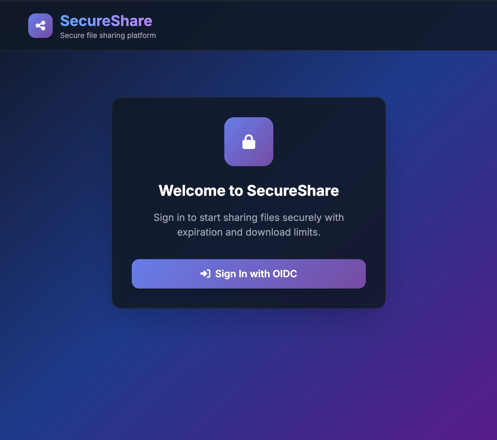
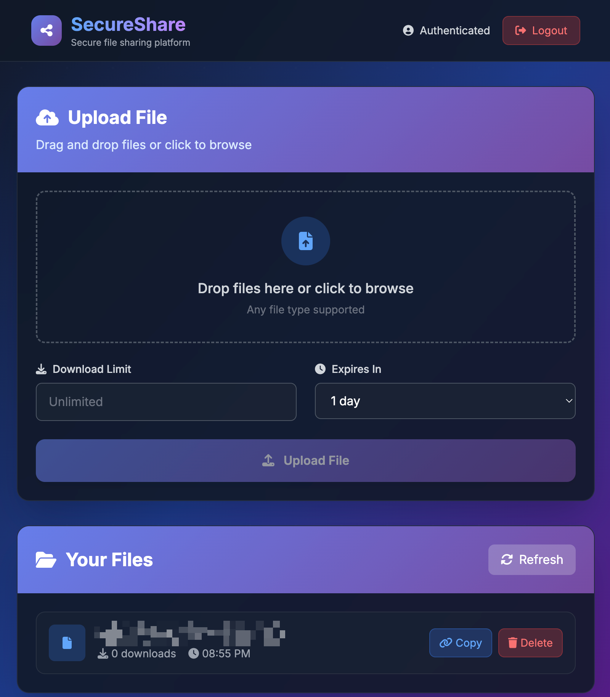

# Simple Filedrop - Ultra-Minimal File Sharing Platform

A simple, modern, secure file sharing application with OIDC authentication, download limits, and automatic expiration. Built with FastAPI and Vue.js in a single-file architecture for maximum simplicity and maintainability.


## ? Use case

Easily upload a file and instantly receive a secure, shareable link. You control access by setting a maximum download count or an automatic expiration date—after which the file is deleted. All access is protected by authentication via your chosen OIDC provider; there’s no manual user management or registration required. Only authenticated users can upload and share files.

## ✨ Features

### 🔐 **Security First**
- **OIDC Authentication** - Industry-standard OAuth/OpenID Connect
- **Session Management** - Secure session handling with signed cookies
- **Token-based Access** - Cryptographically secure file tokens
- **No Public Access** - All operations require authentication

### 📁 **Smart File Management**
- **Download Limits** - Set maximum download counts (1-∞)
- **Automatic Expiration** - Files expire after 1 day to 1 month
- **Auto-Cleanup** - Expired and limit-reached files automatically deleted
- **Real-time Tracking** - Monitor download counts and expiration status

### 🎨 **Modern Interface**
- **Dark Theme** - Professional glassmorphism design
- **Drag & Drop** - Intuitive file upload experience
- **Responsive Design** - Works on desktop, tablet, and mobile
- **Real-time Updates** - Live file status and progress indicators

### ⚡ **Performance & Reliability**
- **Single File Backend** - Ultra-minimal deployment (~200 lines)
- **SQLite Database** - Zero-configuration, embedded database
- **Background Tasks** - Non-blocking file operations
- **Async Operations** - High-performance async/await architecture

## 🖼️ Screenshots

  



## 🚀 Quick Start

### Prerequisites
- Docker & Docker Compose
- Python 3.11+ (for development)

### 1. Clone & Configure
```bash
git clone <your-repo>
cd dropbox

# Configure environment
cp .env.example .env
# Edit .env with your OIDC provider settings
```

### 2. Start Application
```bash
# Production deployment
docker-compose up -d

# Development mode
cd app
python -m pip install -r ../requirements.txt
python main.py
```

### 3. Access Application
- **Web Interface**: http://localhost:8000
- **API Documentation**: http://localhost:8000/docs

## 📋 Configuration

### Environment Variables

Create a `.env` file with your OIDC provider settings:

```bash
# OIDC Authentication (required for production)
OIDC_CLIENT_ID=your_client_id
OIDC_CLIENT_SECRET=your_client_secret
OIDC_DISCOVERY_URL=https://your-provider.com/.well-known/openid_configuration
OIDC_REDIRECT_URI=http://localhost:8000/auth/callback

# Application Settings
DATABASE_PATH=app.db
SESSION_SECRET=your-secret-key-here

# Optional: Custom upload directory
UPLOAD_DIR=uploads
```

### OIDC Providers

Compatible with any OpenID Connect provider:
- **pocket-id** (tested with): `https://your-pocket-id.com/.well-known/openid_configuration`  
- **Auth0**: `https://your-domain.auth0.com/.well-known/openid_configuration`
- **Google**: `https://accounts.google.com/.well-known/openid_configuration`  
- **Microsoft**: `https://login.microsoftonline.com/common/v2.0/.well-known/openid_configuration`
- **Keycloak**: `https://your-keycloak.com/auth/realms/your-realm/.well-known/openid_configuration`

## 🏗️ Architecture

### Project Structure
```
dropbox/
├── app/
│   ├── main.py              # Complete backend (FastAPI)
│   └── static/
│       ├── index.html       # Frontend HTML structure
│       ├── styles.css       # Modern dark theme styles
│       └── app.js          # Vue.js application logic
├── tests/
│   ├── test_secureshare.py  # Comprehensive test suite
│   ├── load_test.py        # Performance testing
│   └── README.md           # Testing documentation
├── requirements.txt         # Python dependencies
├── Dockerfile              # Container configuration
├── docker-compose.yml      # Deployment setup
└── README.md               # This file
```

### Technology Stack

**Backend (main.py)**
- **FastAPI** - Modern async web framework
- **SQLite** - Embedded database
- **OIDC** - Authentication via authlib
- **aiofiles** - Async file operations

**Frontend (static/)**
- **Vue.js 3** - Reactive frontend framework
- **Tailwind CSS** - Utility-first styling
- **FontAwesome** - Icon library
- **Glassmorphism** - Modern UI design

## 📊 API Endpoints

### Authentication
- `GET /auth/me` - Check authentication status
- `GET /auth/login` - Initiate OIDC login
- `GET /auth/callback` - OIDC callback handler
- `POST /auth/logout` - Logout and clear session

### File Operations
- `POST /api/upload` - Upload file with limits
- `GET /api/files` - List user's uploaded files
- `GET /share/{token}` - Download file by token
- `DELETE /api/files/{id}` - Delete file

### Frontend
- `GET /` - Main application interface
- `GET /static/*` - Static assets (CSS, JS, images)

## 🔧 Development

### Local Development Setup
```bash
# Create virtual environment
python -m venv venv
source venv/bin/activate  # Linux/Mac
# or
venv\Scripts\activate     # Windows

# Install dependencies
pip install -r requirements.txt

# Set test environment
export OIDC_CLIENT_ID=""  # Disable auth for testing

# Run application
python app/main.py
```

### Code Organization

**Single File Backend Philosophy**
- All backend logic in `app/main.py` (~200 lines)
- Database, API, auth, and cleanup in one file
- Minimal dependencies, maximum maintainability
- Easy to understand, deploy, and modify

**Separated Frontend**
- Clean HTML structure (`static/index.html`)
- Modern CSS with dark theme (`static/styles.css`)
- Vue.js application logic (`static/app.js`)

## 🚢 Deployment

### Docker Deployment (Recommended)
```bash
# Build and start
docker-compose up -d

# View logs
docker-compose logs -f

# Stop application
docker-compose down
```

### Manual Deployment
```bash
# Install dependencies
pip install -r requirements.txt

# Set production environment
export DATABASE_PATH=/var/lib/secureshare/app.db
export UPLOAD_DIR=/var/lib/secureshare/uploads

# Create directories
mkdir -p /var/lib/secureshare/uploads

# Run application
python app/main.py
```

### Production Considerations
- Set strong `SESSION_SECRET` 
- Configure proper OIDC redirect URIs
- Use reverse proxy (nginx) for HTTPS
- Set up log rotation and monitoring
- Regular database backups
- Monitor disk space for uploads

## 🔒 Security Features

### Authentication & Authorization
- **OIDC Integration** - Delegate authentication to trusted providers
- **Session Security** - Cryptographically signed sessions
- **No Anonymous Access** - All operations require authentication
- **Secure Tokens** - URL-safe, cryptographically random file tokens

### File Security
- **Automatic Cleanup** - Expired files automatically removed
- **Download Limits** - Prevent unlimited file sharing
- **File Isolation** - Files stored with unique tokens
- **No Directory Traversal** - Safe file path handling

### Infrastructure Security
- **Minimal Attack Surface** - Single file backend
- **No File Uploads to Web Root** - Uploads stored separately
- **CORS Configuration** - Configurable cross-origin policies
- **Error Handling** - No sensitive information in error messages

## 🤝 Contributing

You're very welcome to contribute to this project by discussions, issues or pull requests.

## 📜 License

This project is licensed under the MIT License - see the [LICENSE](LICENSE) file for details.
